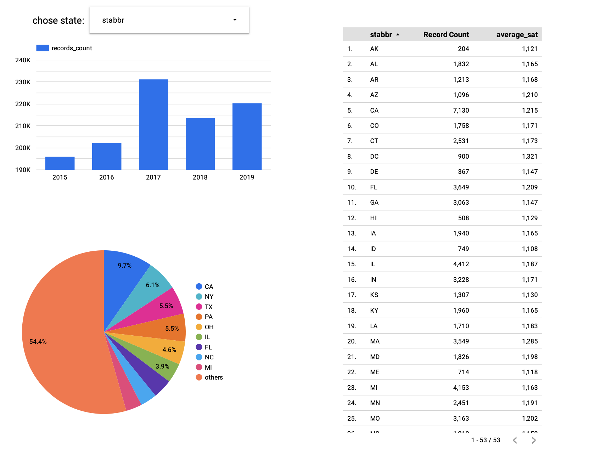
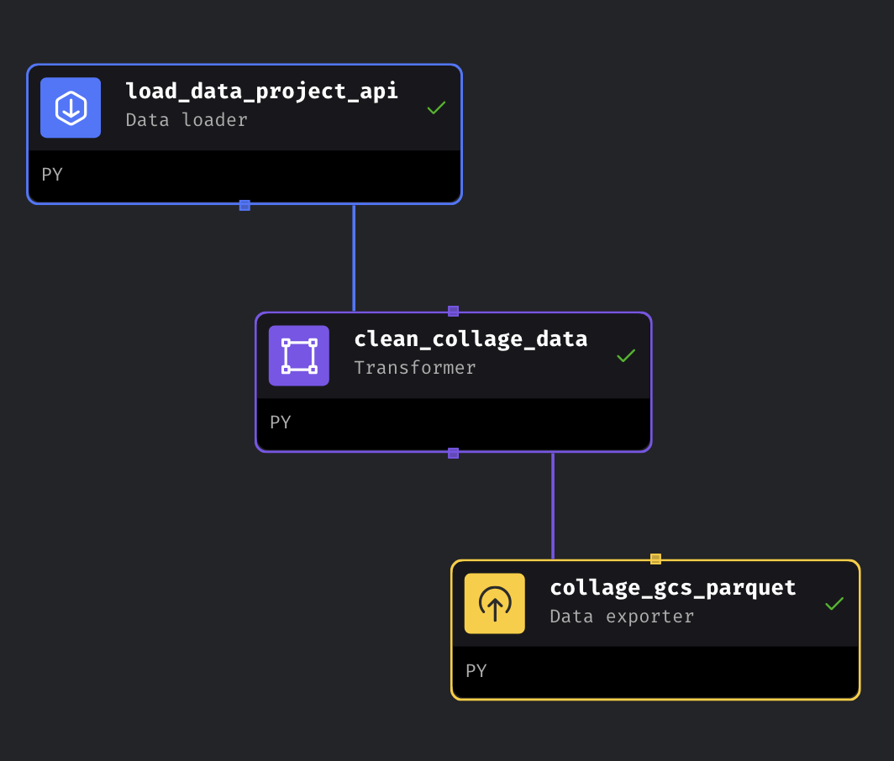

# Data Engineering Zoomcamp Project


## Index
- [Data Engineering Zoomcamp Project](#data-engineering-zoomcamp-project)
  - [Index](#index)
- [Problem Description](#problem-description)
- [Dataset](#dataset)
- [Dashboard](#dashboard)
- [Code Structure](#code-structure)
- [Project details and implementation](#project-details-and-implementation)
- [Reproduce the project](#reproduce-the-project)
  - [Prerequisites](#prerequisites)
  - [Create a Google Cloud Project](#create-a-google-cloud-project)
  - [Creating an environment variable for the credentials](#creating-an-environment-variable-for-the-credentials)
  - [Install and setup Google Cloud SDK](#install-and-setup-google-cloud-sdk)
  - [Create a VM instance](#create-a-vm-instance)
    - [Using the GCP dashboard](#using-the-gcp-dashboard)
  - [Starting and stopping your instance with gcloud sdk after you shut it down](#starting-and-stopping-your-instance-with-gcloud-sdk-after-you-shut-it-down)
  - [Installing the required software in the VM](#installing-the-required-software-in-the-vm)
    - [Docker:](#docker)
    - [Docker compose:](#docker-compose)
    - [Terraform:](#terraform)
    - [Google credentials](#google-credentials)
  - [Upload/download files to/from your instance](#uploaddownload-files-tofrom-your-instance)
  - [Clone the repo in the VM](#clone-the-repo-in-the-vm)
  - [Terraform setup](#terraform-setup)
  - [Set up data ingestion with Airflow](#set-up-data-ingestion-with-airflow)
  - [Perform the data ingestion](#perform-the-data-ingestion)
  - [Setting up dbt Cloud](#setting-up-dbt-cloud)
  - [Deploying models in dbt Cloud with a Production environment](#deploying-models-in-dbt-cloud-with-a-production-environment)
  - [Creating a dashboard](#creating-a-dashboard)

# Problem Description

This is a Data Engineering project that downloads data from the [U.S.Department of Education College Scorecard](https://collegescorecard.ed.gov/data/documentation/). This project allows us to gain educational insights into the educational recordings(like the SAT scores, degree type description etc.) and distributions from different states. We can compare the SAT scores across different states and explore trends from 2015 to 2019. The original dataset contains extensive records for each institution. However, numerous "Null" and "Privacy Suppressed" entries complicate data exploration and the retrieval of key information, especially concerning the admission characteristics of different institutions in various states.


# Dataset

The chosen dataset for this project is the [U.S.Department of Education College Scorecard zip file](https://ed-public-download.app.cloud.gov/downloads/CollegeScorecard_Raw_Data_09262023.zip). 

```
├── data.yaml
├── Crosswalks
│ ├── CW2000.xlsx
│ ├── ......
├── Most-Recent-Cohorts-Field-of-Study.csv
├── Most-Recent-Cohorts-Institution.csv
├── FieldOfStudyData1415_1516_PP.csv
├── FieldOfStudyData1516_1617_PP.csv
├── FieldOfStudyData1617_1718_PP.csv
├── FieldOfStudyData1718_1819_PP.csv
├── FieldOfStudyData1819_1920_PP.csv
├── MERGED2001_02_PP.csv 
├── ......
└── MERGED2021_22_PP.csv

```

For this project, I mainly chose `FieldOfStudyData1415_1516_PP.csv`, `FieldOfStudyData1516_1617_PP.csv`,
`FieldOfStudyData1617_1718_PP.csv`
`FieldOfStudyData1819_1920_PP.csv` and 
`MERGED2019_20_PP.csv` to process data. From the `data.yml` from the original dataset, `MERGED2019_20_PP.csv`  and `FieldOfStudyData1819_1920_PP.csv` files are records of 2019 year. Moreover, through the field of study data, we can figure out the amount of data records distribution on each states from 2015-2019. 
# Dashboard

You may access the dashboard with the visualizations [in this link](https://lookerstudio.google.com/reporting/4ef9a84a-fc0a-4579-8a58-66957f5674ec).

Here is a small screeshot of the Dashboard.

Using the dropdown button, you can select the target state; the bar chart then displays the trend in recording counts for the selected state from 2015 to 2019.

Simultaneously, the geo chart shows that the recordings in 2019, are distributed unevenly across different states. The table indirectly provides the average SAT scores for various colleges in different states.

# Code Structure 

```
├── requirement.txt
├── data_schema
├── dbt
├── gcp_datawarehouse
├── mage-zoomcamp
│ ├── img_feats
│ ├── pretained_classifier
├── image
│ ├── dashboard_screenshot.png
├── terraform_project
└── ReadMe.md
```

# Project details and implementation

This project mainly utilize Google Cloud Platform, Big Query and Cloud storage.

Cloud infrastructure is mostly managed with Terraform. Details in [Terraform setup](#terraform-setup).

Data ingestion is through Mage. Before data ingestion, to obatin the data schema, I utilized the `project/data_schema/upload_data_get_schema.ipynb` through connecting to the postgre(command in services file).

Through the `project_pipeline_datalake` 
pipeline, the DAG transforms csv file into parquet and upload to bucket. 

Through the `project_pipeline_data_warehouse` pipeline, the DAG transforms csv file into parquet and upload to bucket. 
,
Then in the [big query](gcp_datawarehouse/project_query_merge.sql), the data is partitioned by `st_fips`(FIPS code for state). The reason why I chose `st_fips` is I compared `st_fips` with other variables, as the data does not contain datetime, so Integer should be chosen. When exploring the length of slot millisecond and size of byte process with different variables, the `st_fips` is the best one, with 1.52 KB byte processing, 0 sec duration and 197 Slot milliseconds. The number of partition variables is larger, the time will be shorter and byte processing will be smaller. Then, I chose `unitid` as cluster for the similar reason.

dbt is also utilized for creating the transformations to build visualizations(Model and Materialized view in the dbt folder).

Moreover, there are two tables in order to visualize the data. Building one time-series figure durning 2015-2019, the recording count of different states changes as time. Another one is to get the SAT scores for different states in 2019.

# Reproduce the project

## Prerequisites

The following requirements are needed to reproduce the [Set up project infrastructure with Terraform](#set-up-project-infrastructure-with-terraform).

1. A [Google Cloud Platform](https://cloud.google.com/) account.
1. (Optional) The [Google Cloud SDK](https://cloud.google.com/sdk). Instructions for installing it are below.


Development and testing were carried out using a Google Cloud Compute VM instance. I strongly recommend that a VM instance is used for reproducing the project as well. All the instructions below will assume that a VM is used.

## Create a Google Cloud Project

Access the [Google Cloud dashboard](https://console.cloud.google.com/) and create a new project from the dropdown menu on the top left of the screen, to the right of the _Google Cloud Platform_ text.

After you create the project, you will need to create a _Service Account_ with the following roles:
* `BigQuery Admin`
* `Storage Admin`
* `Storage Object Admin`
* `Viewer`

Download the Service Account credentials file, rename it to `google_credentials.json` and store it in your home folder, in `$HOME/.google/credentials/` .

You will also need to activate the following APIs:
* https://console.cloud.google.com/apis/library/iam.googleapis.com
* https://console.cloud.google.com/apis/library/iamcredentials.googleapis.com

If all of these steps are unfamiliar to you, please review [Lesson 1.3.1 - Introduction to Terraform Concepts & GCP Pre-Requisites (YouTube)](https://youtu.be/Hajwnmj0xfQ?t=198), or check out my notes [here](https://github.com/ziritrion/dataeng-zoomcamp/blob/main/notes/1_intro.md#gcp-initial-setup).

## Creating an environment variable for the credentials

Create an environment variable called `GOOGLE_APPLICATION_CREDENTIALS` and assign it to the path of your json credentials file, which should be `$HOME/.google/credentials/` . Assuming you're running bash:

1. Open `.bashrc`:
    ```sh
    nano ~/.bashrc
    ```
1. At the end of the file, add the following line:
    ```sh
    export GOOGLE_APPLICATION_CREDENTIALS="<path/to/authkeys>.json"
    ```
1. Exit nano with `Ctrl+X`. Follow the on-screen instructions to save the file and exit.
1. Log out of your current terminal session and log back in, or run `source ~/.bashrc` to activate the environment variable.
1. Refresh the token and verify the authentication with the GCP SDK:
    ```sh
    gcloud auth application-default login
    ```

## Install and setup Google Cloud SDK

1. Download Gcloud SDK [from this link](https://cloud.google.com/sdk/docs/install) and install it according to the instructions for your OS.
1. Initialize the SDK [following these instructions](https://cloud.google.com/sdk/docs/quickstart).
    1. Run `gcloud init` from a terminal and follow the instructions.
    1. Make sure that your project is selected with the command `gcloud config list`

## Create a VM instance

### Using the GCP dashboard

1. From your project's dashboard, go to _Cloud Compute_ > _VM instance_
1. Create a new instance:
    * Any name of your choosing
    * Pick your favourite region. You can check out the regions [in this link](https://cloud.google.com/about/locations).
        > ***IMPORTANT***: make sure that you use the same region for all of your Google Cloud components.
    * Pick a _E2 series_ instance. A _e2-standard-4_ instance is recommended (4 vCPUs, 16GB RAM)
    * Change the boot disk to _Ubuntu_. The _Ubuntu 20.04 LTS_ version is recommended. Also pick at least 30GB of storage.
    * Leave all other settings on their default value and click on _Create_.


1. Go to https://github.com/docker/compose/releases and copy the URL for the  `docker-compose-linux-x86_64` binary for its latest version.
    * At the time of writing, the last available version is `v2.2.3` and the URL for it is https://github.com/docker/compose/releases/download/v2.2.3/docker-compose-linux-x86_64
1. Create a folder for binary files for your Linux user:
    1. Create a subfolder `bin` in your home account with `mkdir ~/bin`
    1. Go to the folder with `cd ~/bin`
1. Download the binary file with `wget <compose_url> -O docker-compose`
    * If you forget to add the `-O` option, you can rename the file with `mv <long_filename> docker-compose`
    * Make sure that the `docker-compose` file is in the folder with `ls`
1. Make the binary executable with `chmod +x docker-compose`
    * Check the file with `ls` again; it should now be colored green. You should now be able to run it with `./docker-compose version`
1. Go back to the home folder with `cd ~`
1. Run `nano .bashrc` to modify your path environment variable:
    1. Scroll to the end of the file
    1. Add this line at the end:
       ```bash
        export PATH="${HOME}/bin:${PATH}"
        ```
    1. Press `CTRL` + `o` in your keyboard and press Enter afterwards to save the file.
    1. Press `CTRL` + `x` in your keyboard to exit the Nano editor.
1. Reload the path environment variable with `source .bashrc`
1. You should now be able to run Docker compose from anywhere; test it with `docker-compose version`
### Terraform:
1. Run `curl -fsSL https://apt.releases.hashicorp.com/gpg | sudo apt-key add -`
1. Run `sudo apt-add-repository "deb [arch=amd64] https://apt.releases.hashicorp.com $(lsb_release -cs) main"`
1. Run `sudo apt-get update && sudo apt-get install terraform`

### Google credentials

Make sure that you upload the `google_credentials.json` to `$HOME/.google/credentials/` and you create the `GOOGLE_APPLICATION_CREDENTIALS` as specified in the _Creating an environment variable for the credentials_ section.

## Upload/download files to/from your instance


## Clone the repo in the VM

Log in to your VM instance and run the following from your `$HOME` folder:

```sh
git clone https://github.com/ziritrion/dataeng-zoomcamp.git
```

The contents of the project can be found in the `dataeng-zoomcamp/7_project` folder.

>***IMPORTANT***: I strongly suggest that you fork my project and clone your copy so that you can easily perform changes on the code, because you will need to customize a few variables in order to make it run with your own infrastructure.

## Set up project infrastructure with Terraform

Make sure that the credentials are updated and the environment variable is set up.

1. Go to the `dataeng-zoomcamp/7_project/terraform` folder.

1. Open `variables.tf` and edit line 11 under the `variable "region"` block so that it matches your preferred region.

1. Initialize Terraform:
    ```sh
    terraform init
    ```
1. Plan the infrastructure and make sure that you're creating a bucket in Cloud Storage as well as a dataset in BigQuery
    ```sh
    terraform plan
    ```
1. If the plan details are as expected, apply the changes.
    ```sh
    terraform apply
    ```

You should now have a bucket called `data_lake` and a dataset called `gh-archive-all` in BigQuery.

## Set up data ingestion with Airflow

1. Go to the `dataeng-zoomcamp/7_project/airflow` folder.
1. Run the following command and write down the output:
    ```sh
    echo -e "AIRFLOW_UID=$(id -u)"
    ```
1. Open the `.env` file and change the value of `AIRFLOW_UID` for the value of the previous command.
1. Change the value of `GCP_PROJECT_ID` for the name of your project id in Google Cloud and also change the value of `GCP_GCS_BUCKET` for the name of your bucket.
1. Build the custom Airflow Docker image:
    ```sh
    docker-compose build
    ```
1. Initialize the Airflow configs:
    ```sh
    docker-compose up airflow-init
    ```
1. Run Airflow
    ```sh
    docker-compose up
    ```

You may now access the Airflow GUI by browsing to `localhost:8080`. Username and password are both `airflow` .
>***IMPORTANT***: this is ***NOT*** a production-ready setup! The username and password for Airflow have not been modified in any way; you can find them by searching for `_AIRFLOW_WWW_USER_USERNAME` and `_AIRFLOW_WWW_USER_PASSWORD` inside the `docker-compose.yaml` file.

## Perform the data ingestion

If you performed all the steps of the previous section, you should now have a web browser with the Airflow dashboard.

The DAG is set up to download all data starting from April 1st 2022. You may change this date by modifying line 202 of `dataeng-zoomcamp/7_project/airflow/dags/data_ingestion.py` . It is not recommended to retrieve data earlier than January 1st 2015, because the data was retrieved with a different API and it has not been tested to work with this pipeline. Should you change the DAG date, you will have to delete the DAG in the Airflow UI and wait a couple of minutes so that Airflow can pick up the changes in the DAG.

To trigger the DAG, simply click on the switch icon next to the DAG name. The DAG will retrieve all data from the starting date to the latest available hour and then perform hourly checks on every 30 minute mark.

After the data ingestion, you may shut down Airflow by pressing `Ctrl+C` on the terminal running Airflow and then running `docker-compose down`, or you may keep Airflow running if you want to update the dataset every hour. If you shut down Airflow, you may also shut down the VM instance because it won't be needed for the following steps.

## Setting up dbt Cloud

1. Create a [dbt CLoud account](https://www.getdbt.com/).
1. Create a new project.
    1. Give it a name (`gh-archive` is recommended), and under _Advanced settings_, input `7_project/dbt` as the _Project subdirectory_.
    1. Choose _BigQuery_ as a database connection.
    1. Choose the following settings:
        * You may leave the default connection name.
        * Upload a Service Account JSON file > choose the `google_credentials.json` we created previously.
        * Under _BigQuery Optional Settings_, make sure that you put your Google Cloud location under _Location_.
        * Under _Development credentials_, choose any name for the dataset. This name will be added as a prefix to the schemas. In this project the name `dbt` was used.
        * Test the connection and click on _Continue_ once the connection is tested successfully.
    1. In the _Add repository from_ form, click on Github and choose your fork from your user account. Alternatively, you may provide a URL and clone the repo.
1. Once the project has been created, you should now be able to click on the hamburger menu on the top left and click on _Develop_ to load the dbt Cloud IDE.

You may now run the `dbt run` command in the bottom prompt to run all models; this will generate 3 different datasets in BigQuery:
* `<prefix>_dwh` hosts the data warehouse materialized table with all of the ingested data.
* `<prefix>_staging` hosts the staging views for generating the final end-user tables.
* `<prefix>_core` hosts the end-user tables.

## Deploying models in dbt Cloud with a Production environment

1. Click on the hamburger menu on the top left and click on _Environments_.
1. Click on the _New Environment_ button on the top right.
1. Give the environment a name (`Production` is recommended), make sure that the environment is of type _Deployment_ and in the _Credentials_ section, you may input a name in the _Dataset_ field; this will add a prefix to the schemas, similarly to what we did in when setting up the development environment (`production` is the recommended prefix but any prefix will do, or you may leave it blank).
1. Create a new job with the following settings:
    * Give it any name; `dbt run` is recommended.
    * Choose the environment you created in the previous step.
    * Optionally, you may click on the _Generate docs?_ checkbox.
    * In the _Commands_ section, add the command `dbt run`
    * In the _Triggers_ section, inside the _Schedule_ tab, make sure that the _Run on schedule?_ checkbox is checked. Select _custom cron schedule_ and input the string `40 * * * *`; this will run the models every hour on the 40th minute (the DAG runs on the 30th minute, the 10 minute delay is to make sure that the DAG is run successfully).
1. Save the job.

You may now trigger the job manually or you may wait until the scheduled trigger to run it. The first time you run it, 3 new datasets will be added to BigQuery following the same pattern as in the development environment.

## Creating a dashboard

The dashboard used in this project was generated with [Google Data Studio](https://datastudio.google.com/) (GDS from now on). Dashboards in GDS are called _reports_. Reports grab data from _data sources_. We will need to generate 2 data sources and a report:

1. Generate the data sources.
    1. Click on the _Create_ button and choose _Data source_.
    1. Click on the _BigQuery_ connector.
    1. Choose your Google Cloud project, choose your _production core_ dataset and click on the `users` table. Click on the _Connect_ button at the top.
    1. You may rename the data source by clicking on the name at the top left of the screen. The default name will be the name of the chosen table.
    1. Click on the GDS icon on the top left to go back to the GDS front page and repeat all of the previous steps but choose the _production staging_ dataset and the `stg_commits` table.
1. Generate the report.
    1. Click on the _Create_ button and choose _Report_.
    1. If the _Add data to report_ pop-up appears, choose the `My data sources` tab and choose one of the data sources. Click on the _Add to report_ button on the confirmation pop-up.
    1. Once you're in the report page, click on the _Add data_ button on the top bar and choose the other data source you created.
    1.  You may delete any default widgets created by GDS.
1. Add the _Top Github Contributors_ widget.
    1. Click on the _Add a chart_ button on the top bar and select _Table_.
    1. On the left bar, in _Data source_ choose the dats source with the `users` table.
    1. In _Dimension_, choose `actor_login` as the only dimension.
    1. In _Metric_, choose `commit_count` as the only metric.
    1. In _Sort_, choose `commit_count` and click on _Descending_.
1. Add the _Commits per day_ widget.
    1. Click on the _Add a chart_ button on the top bar and select _Time series chart_.
    1. On the left bar, in _Data source_ choose the dats source with the `stg_commits` table.
    1. In _Dimension_, choose `created_at` as the only dimension.
    1. In _Metric_, choose `Record Count` as the only metric.

You should now have a functioning dashboard.

_[Back to the repo index](https://github.com/ziritrion/dataeng-zoomcamp)_